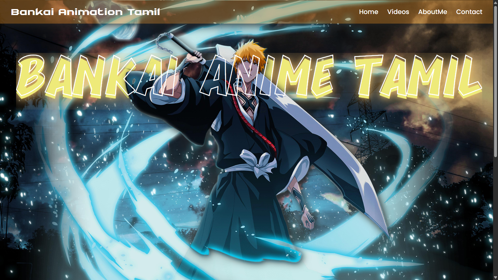

<p align="center">
  
</p>
<br>


# 🌌 Bankai Animation – React + Vite Website

> ⚔️ _“Welcome to the digital world of anime, explained and explored – Tamil style.”_

This is the official **experimental website** of [**Bankai Animation**](https://youtube.com/@BankaiAnimationTamil), a YouTube channel dedicated to anime explanation videos, character breakdowns, timelines, and storytelling — all in **Tamil**!

---

## 💻 Tech Stack

- ⚛️ **React** – UI Library
- ⚡ **Vite** – Fast development & build tool
- 🧹 **ESLint** – Linting rules for clean code
- 🎨 **CSS** – Custom anime-themed styling

Using:

- [`@vitejs/plugin-react`](https://github.com/vitejs/vite-plugin-react) – Fast Refresh with Babel

---

## 🧭 Project Goals

🎥 Showcase anime explanation videos  
🧙‍♂️ Present the creator’s personality and journey  
🌸 Create a fun, modern fan hub for anime lovers  

<p align="center">
  
</p>

---

## 🚀 Getting Started

```bash
npm install
npm run dev
